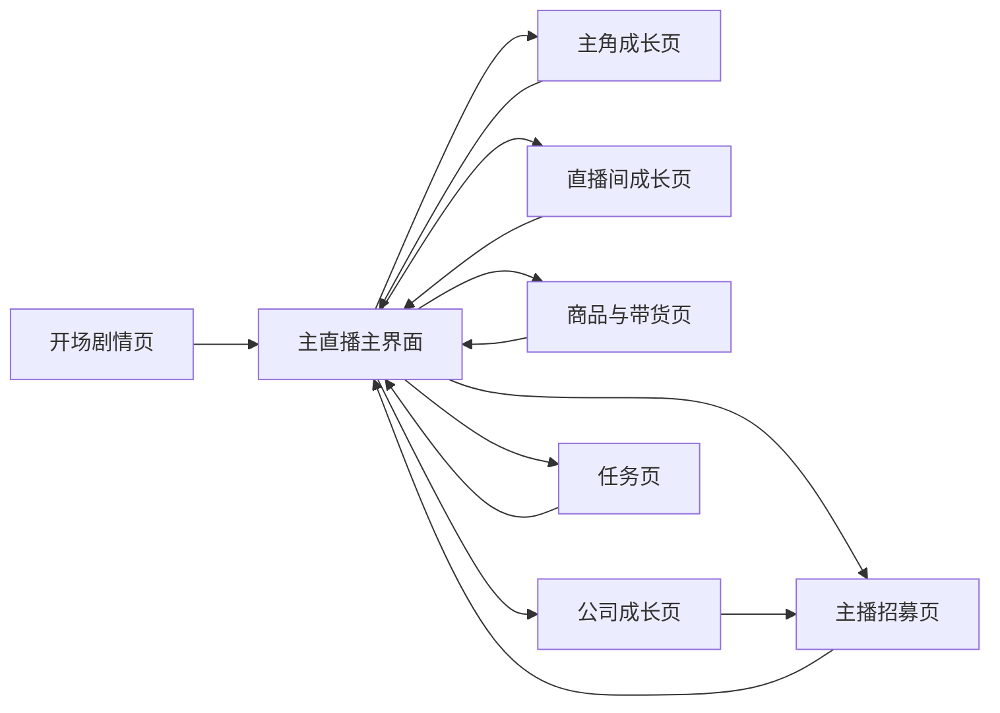

# 微信小游戏页面与交互需求文档 V1

## 1. 文档信息

- 文档名称：页面与交互需求文档
- 适用阶段：MVP 策划定义
- 对应产品：女主播逆袭与 MCN 公司成长模拟经营
- 文档日期：2026-04-08

## 2. 文档用途

本文件用于从“系统策划”进一步落到“页面与交互策划”，让项目组明确：

1. 首版到底有哪些核心页面。
2. 每个页面承担什么作用。
3. 玩家如何在这些页面之间切换。
4. 每个页面上最重要的信息和按钮是什么。
5. 哪些交互必须简单直接，不能做复杂。

本文件仍然是策划需求文档，重点是玩家体验、页面功能和交互目标，不涉及客户端代码实现细节。

## 3. 页面设计目标

首版页面与交互设计必须服务于以下目标：

1. 让新玩家在很短时间内看懂主流程。
2. 让玩家大部分时间停留在主直播主界面，减少迷路感。
3. 让每个二级页只有一个明确用途，不做大而全的信息堆叠。
4. 让玩家始终知道“下一步最值得点哪里”。
5. 让页面切换和弹窗出现不打断成长节奏。

## 4. 页面设计原则

### 4.1 主界面优先

首版体验必须以 `主直播主界面` 为核心。大多数成长、收益反馈、任务提醒和广告建议都围绕主界面展开。

### 4.2 二级页单一职责

每个二级页只解决一个问题：

1. 主角页只负责养女主。
2. 直播间页只负责升级房间。
3. 公司页只负责阶段成长与解锁。
4. 招募页只负责主播获取与查看。

### 4.3 信息层级清楚

每个页面都必须明确：

1. 第一眼最重要的信息
2. 第一优先按钮
3. 第二优先按钮
4. 当前不该让玩家分心的信息

### 4.4 新手路径收束

首版新手期只允许玩家在非常有限的页面和按钮之间移动，避免“按钮很多，但不知道点哪个”。

## 5. 页面总览

首版建议保留以下 8 个核心页面与 3 类核心弹窗。

### 5.1 核心页面

1. 开场剧情页
2. 主直播主界面
3. 主角成长页
4. 直播间成长页
5. 商品与带货页
6. 公司成长页
7. 主播招募页
8. 任务页

### 5.2 核心弹窗

1. 离线收益弹窗
2. 章节奖励弹窗
3. 系统解锁弹窗

## 6. 页面关系总图

页面关系建议如下：

页面之间的关系原则：

1. 所有二级页都应能一跳返回主直播主界面。
2. 主界面必须是唯一总入口。
3. 公司页与招募页存在直接关系，但仍不应形成复杂跳转链。

## 7. 页面详细需求

### 7.1 开场剧情页

#### 页面定位

用于承接“被辞退的女主播重新出发”的题材包装，同时完成最初的情绪代入。

#### 页面目标

1. 用最短时间让玩家理解女主处境。
2. 不拖慢进入玩法的速度。
3. 给后续第一轮成长提供情绪理由。

#### 页面内容

1. 女主被辞退的轻喜剧化开场
2. 回到房间准备重新开播的决定
3. 一个明确的“开始直播人生”主按钮

#### 交互要求

1. 剧情页不超过 4 屏。
2. 单屏文案短，按钮明确。
3. 首次进入可完整播放，再次进入默认跳过。

#### 页面重点

玩家在这里不需要做决策，只需要快速代入并进入主界面。

### 7.2 主直播主界面

#### 页面定位

这是全游戏最核心的页面，承担“看收益、点成长、收反馈、切系统”的绝大部分功能。

#### 页面目标

1. 让玩家一眼看到自己当前的直播状态。
2. 让玩家快速完成最常见的操作。
3. 让玩家始终知道现在最值得点哪里。

#### 页面内容结构

建议分成 5 个区块：

1. 顶部信息区：金币、章节进度、公司等级、红点提示
2. 中央直播表现区：女主/主播直播表现、流量变化、订单反馈
3. 主成长快捷区：主角成长、直播间成长、公司成长入口
4. 商品与收益区：当前主推商品、收益速度、带货状态
5. 底部功能区：任务、招募、分享等次级入口

#### 主按钮优先级

1. 主角成长
2. 直播间成长
3. 商品调整
4. 公司成长
5. 任务领取

#### 交互要求

1. 主界面必须能在不跳页的情况下看到“收益正在增长”。
2. 主成长入口要常驻，不能藏太深。
3. 红点只打在最值得立即点击的入口上，避免全屏都是提醒。
4. 商品切换和收益反馈必须足够直观。

#### 页面重点

首版的大部分时间都应该停留在这里，所以主界面一定不能做得像“菜单页”，而要像“正在发生事情的页面”。

### 7.3 主角成长页

#### 页面定位

承接女主个人逆袭阶段，是前期最主要的养成页。

#### 页面目标

1. 让玩家持续愿意投入女主。
2. 每次升级都能看到清晰反馈。
3. 不让成长线过多导致选择困难。

#### 页面内容结构

1. 顶部展示女主当前形象和阶段称号
2. 中部展示三条成长线：化妆、技能、穿搭
3. 每条成长线显示当前等级、下一级收益、升级花费
4. 底部展示综合提升预览或一句短反馈文案

#### 交互要求

1. 升级按钮必须明确且连续可点。
2. 升级前后要看到具体变化。
3. 阶段性外观变化要明显。
4. 不做复杂技能树展开。

#### 页面重点

玩家在这个页面应该感受到“她真的越来越像专业主播了”。

### 7.4 直播间成长页

#### 页面定位

承接“房间从简陋到精致”的环境成长，是前期第二重要投入页。

#### 页面目标

1. 让房间变化成为可见的成就反馈。
2. 让玩家理解房间升级不只是好看，也会提高收益。
3. 避免复杂装修操作带来理解成本。

#### 页面内容结构

1. 中央展示当前直播间全景
2. 下方切换四类升级：设备、布置、氛围、带货设备
3. 每类显示当前等级、升级效果、升级花费
4. 可显示升级前后预览

#### 交互要求

1. 页面应强调“升级”而不是“自由装修”。
2. 升级后外观替换必须立即可见。
3. 每次升级都要能看到收益方向说明，如“提高流量”或“提高带货效率”。

#### 页面重点

玩家在这里的体验应是“我在帮她把直播间一点点做起来”。

### 7.5 商品与带货页

#### 页面定位

负责管理当前主推商品，是经营感最直接的页面。

#### 页面目标

1. 给玩家一个很轻的经营决策点。
2. 让商品切换对收益变化足够直观。
3. 保持简单，不做复杂库存或供应链系统。

#### 页面内容结构

1. 当前商品位状态
2. 可选商品列表
3. 商品基础标签：转化倾向、利润倾向、解锁章节
4. 当前主推商品收益预估

#### 交互要求

1. 当前主推商品必须高亮。
2. 玩家切换商品后，收益变化要能直观看懂。
3. 不展示过多经营维度，只保留“更稳 / 更赚”这种轻判断。

#### 页面重点

商品页的任务不是让玩家研究，而是让玩家做一个轻选择后马上看到反馈。

### 7.6 公司成长页

#### 页面定位

承接长期成长目标，是从个人主播走向 MCN 的阶段控制页。

#### 页面目标

1. 让玩家明确看到事业正在升级。
2. 让每次公司升级都对应具体解锁。
3. 让章节目标和公司成长形成强绑定。

#### 页面内容结构

1. 当前章节名与阶段视觉
2. 当前公司等级与下一级收益
3. 当前章节目标列表
4. 下一章节将解锁内容预告
5. 直播位、商品位、招募功能等关键解锁说明

#### 交互要求

1. 目标列表必须短且易懂。
2. 已完成目标即时勾选。
3. 升级公司后必须给出明显的仪式感反馈。

#### 页面重点

这个页面不是给玩家“看很多数字”，而是让玩家感受到“我已经不是一个人在播了”。

### 7.7 主播招募页

#### 页面定位

用于承接第 3 章后的内容扩张，是玩家从“养女主”转向“带团队”的关键页面。

#### 页面目标

1. 让首次招募成为明显的新内容高潮。
2. 让玩家理解主播是辅助和扩张，而不是替代女主。
3. 让招募页面同时具备收集感和简单性。

#### 页面内容结构

1. 当前招募池展示
2. 可招募主播卡片
3. 免费招募入口与普通招募入口
4. 已拥有主播列表与上阵状态

#### 交互要求

1. 第一次进入时要突出“免费招募”。
2. 招募结果演出必须明显。
3. 已获得主播的作用要写清楚，如偏流量或偏带货。
4. 不做过深筛选和复杂阵容编辑。

#### 页面重点

招募页应让玩家感到“公司真的开始扩张了”，而不是单纯抽卡。

### 7.8 任务页

#### 页面定位

用于持续提供短目标，减少玩家不知道该做什么的空窗期。

#### 页面目标

1. 把主线拆成小目标。
2. 提供立即可用的奖励。
3. 提醒玩家当前最值得做的事。

#### 页面内容结构

1. 新手任务
2. 章节任务
3. 日常任务
4. 当前进度与奖励展示

#### 交互要求

1. 已完成任务要有明确红点和领取反馈。
2. 领取链路尽量短。
3. 新手和章节任务优先级高于日常任务。

#### 页面重点

任务页不是常驻停留页，而是给玩家一个“确认下一步”的地方。

## 8. 核心交互关系

### 8.1 新手前 10 分钟主路径

建议主路径如下：

1. 开场剧情页
2. 主直播主界面
3. 主角成长页
4. 直播间成长页
5. 回到主界面开播
6. 商品与带货页
7. 收益反馈
8. 再回到主界面推进

新手阶段不建议频繁打开：

1. 公司成长页
2. 任务页深层切换
3. 招募页（第 3 章前未开放）

### 8.2 中期常见交互路径

进入正常经营后，玩家最常见的行为链应是：

1. 主界面看收益
2. 点主角成长或直播间成长
3. 回主界面看变化
4. 视情况切商品
5. 去公司页确认下一阶段目标

### 8.3 扩张阶段常见交互路径

第 3 章后应新增一条高频路径：

1. 公司成长页查看招募已解锁
2. 进入招募页获得主播
3. 回主界面或直播位上阵页
4. 收益变化即时可见

## 9. 页面状态规则

### 9.1 未解锁状态

1. 未解锁页面入口可以显示，但必须写清楚解锁条件。
2. 未解锁状态不应让玩家误以为是功能坏了。

### 9.2 红点状态

红点仅用于以下几类高价值事件：

1. 有可领取任务奖励
2. 有明显更优升级可做
3. 有新功能刚解锁
4. 有免费招募可用

红点不应泛滥到所有入口。

### 9.3 弱提示状态

对于广告、商品切换、收益加速等内容，首版建议更多使用弱提示，而不是强弹跳转。

## 10. 页面文案与表现原则

1. 文案尽量短，不做说明书式长段文字。
2. 页面命名要符合玩家直觉，如“主角成长”“直播间升级”“公司成长”。
3. 所有成长页都要强调“升级后会更好看 / 更赚钱 / 更像样”。
4. 反馈文案以鼓励和陪伴感为主，符合女性向轻松成长气质。

## 11. MVP 边界

首版页面交互只做“简单、清楚、可持续点击”的结构，不做以下内容：

1. 多层级嵌套菜单
2. 自由摆放编辑器
3. 复杂阵容编辑页
4. 深度筛选和排序系统
5. 过度动画导致流程变慢

## 12. 验收标准

1. 玩家第一次进入后，能在 60 秒内理解主要页面关系。
2. 主直播主界面能承担绝大多数高频操作。
3. 二级页各自职责清楚，不会让玩家迷路。
4. 玩家在前 2 章中不会频繁问“下一步点哪里”。
5. 页面设计能同时支持前期个人成长和后期 MCN 扩张两阶段体验。
